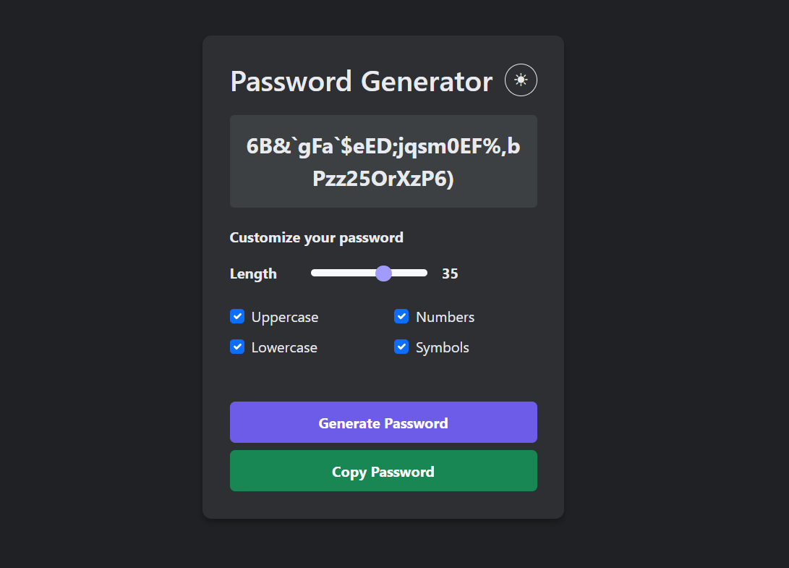

# Password Generator

A simple password generator with customization options and dark mode.

## Features
- Adjustable password length (4-32 characters)
- Toggle character types: uppercase, lowercase, numbers, symbols
- Light/dark mode toggle
- Copy to clipboard functionality


## How to Use
1. Use the slider to set length
2. Check/uncheck character types
3. Click "Generate Password"
4. Click "Copy Password" to copy

## Live Demo
[🔗Password Generator Link](https://virus-xp.github.io/password-generator/)

## Technologies
- HTML5
- CSS3 (with Bootstrap 5)
- JavaScript

## Installation
No installation needed - just open `index.html` in any modern browser.

## Project Structure

```bash
/password-generator/
├── index.html
├── styles.css
├── script.js
└── README.md
```